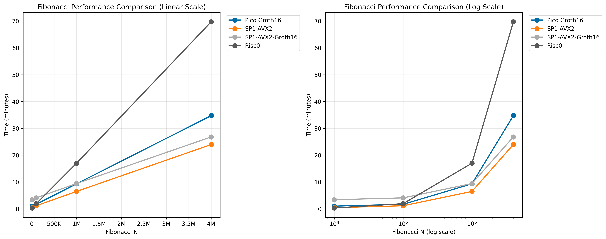

# zkVMs benchmarks

## Results on Intel Xeon Gold 6226R (16 cores, 60 GiB ram)



## Notes

This provides a benchmark for proving times of different zkVMs

It's important to note most provers have three proofs that gets further

base_proofs -> recursive_stark_proof -> snark_proof

Each phase adds more proving times and reduces proof size. The final step is only needed to verify directly in Ethereum

Aligned supports verification of proofs of any stage, so you can use the faster one you see

## How to run

### Requirements

- risc0
- sp1
- pico
- Docker (For SP1 groth16 compression)

### Running the benchmark

To run the benchmark, first do a run with small programs to see if everything is working:

```TEST_MODE=1 bash benchmark.sh```

First run will also download SP1 docker image for groth16 compression, so the values for that bench may be off on this first run.

After making sure it work, you can run:

```bash benchmark.sh```

If you want to force SP1 to get the images, prove a small program with:

```PROOF_MODE=groth16 N=5 make fibo_sp1```

In ubuntu, you can install everything you need with:

```sh
# Install system dependencies and Docker
sudo apt-get update
sudo apt-get install -y gcc pkg-config libssl-dev build-essential apt-transport-https ca-certificates curl software-properties-common
sudo install -m 0755 -d /etc/apt/keyrings
sudo curl -fsSL https://download.docker.com/linux/ubuntu/gpg -o /etc/apt/keyrings/docker.asc
sudo chmod a+r /etc/apt/keyrings/docker.asc
echo \
  "deb [arch=$(dpkg --print-architecture) signed-by=/etc/apt/keyrings/docker.asc] https://download.docker.com/linux/ubuntu \
  $(. /etc/os-release && echo "${UBUNTU_CODENAME:-$VERSION_CODENAME}") stable" | \
  sudo tee /etc/apt/sources.list.d/docker.list > /dev/null
sudo apt-get update
sudo apt-get install -y docker-ce docker-ce-cli containerd.io docker-buildx-plugin docker-compose-plugin
sudo groupadd docker || true
sudo usermod -aG docker $USER

# Install and setup Rust
curl --proto '=https' --tlsv1.2 -sSf https://sh.rustup.rs | sh -s -- -y
export PATH="$HOME/.cargo/bin:$PATH"
. "$HOME/.cargo/env"
rustup toolchain install nightly
rustup component add rust-src --toolchain nightly-2024-11-27-x86_64-unknown-linux-gnu

# Install remaining tools
curl -L https://sp1.succinct.xyz | bash
source "$HOME/.bashrc"
sp1up
curl -L https://risczero.com/install | bash
. "$HOME/.bashrc"
rzup install
cargo +nightly install --git https://github.com/brevis-network/pico pico-cli

echo "Installation complete! Please run 'newgrp docker' or log out and back in to use Docker without sudo."
```
