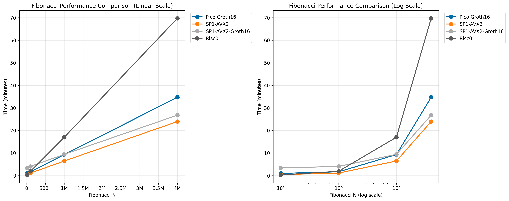
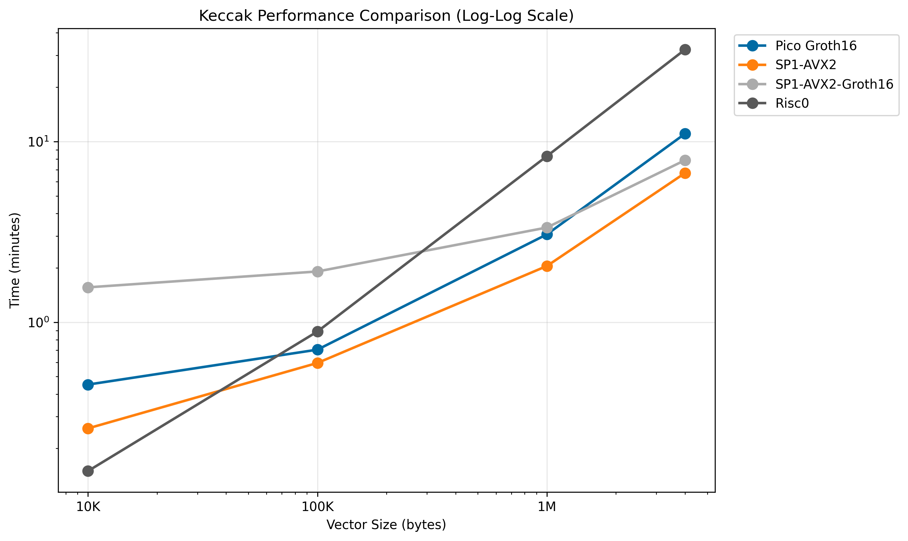
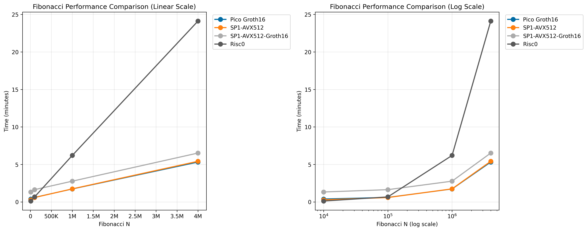
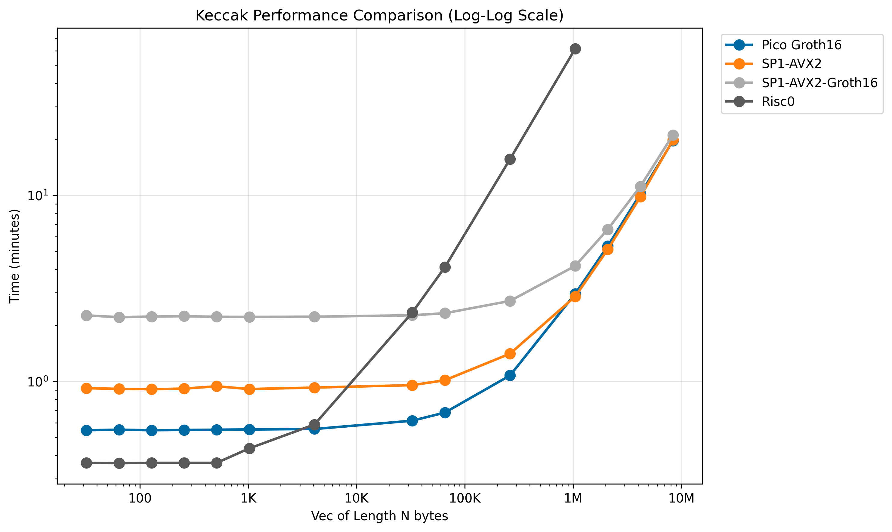

# zkVMs benchmarks

## Fibonacci Benchmarks

### Results on Intel Xeon Gold 6226R (16 cores, 60 GiB ram)



### Results on AMD EPYC 7543 (32 cores, 128 GiB ram)



### Results on AMD EPYC 8534P (64 cores, 576 GiB ram)



## Keccak Benchmarks

### Results on AMD EPYS 7543 (32 cores, 128 GiB ram)



## Notes

This provides a benchmark for proving times of different zkVMs

It's important to note most provers have three proofs that gets further

base_proofs -> recursive_stark_proof -> snark_proof

Each phase adds more proving times and reduces proof size. The final step is only needed to verify directly in Ethereum.

SP1 is benched with recursive_stark and snark proof. Pico is always using the snark proof. 

Aligned supports verification of proofs of any stage, so you can use the faster one you see

## How to run

### Requirements

- risc0
- sp1
- pico
- Docker (For SP1 groth16 compression)

### Running all benchmarks

To run all benchmarks, first do a run with small programs to see if everything is working:

```shell
TEST_MODE=1 bash benchmark.sh
```

If you are benching Groth16 in SP1, try proving a small program manually to double check it's fine. First run will also download SP1 docker image for groth16 compression, so the values for that bench may be off on this first run.

```shell
make build_fibo_sp1
PROOF_MODE=groth16 N=5 make fibo_sp1
make build_keccak_sp1
PROOF_MODE=groth16 N=5 make keccak_sp1
```

After making sure it works, you can run:

```shell
bash benchmark.sh
```


### Running the fibonacci benchmark

To run the benchmark, first do a run with small programs to see if everything is working:

```shell
TEST_MODE=1 bash benchmark_fibo.sh
```

If you are benching Groth16 in SP1, try proving a small program manually to double check it's fine. First run will also download SP1 docker image for groth16 compression, so the values for that bench may be off on this first run.

```shell
make build_fibo_sp1
PROOF_MODE=groth16 N=5 make fibo_sp1
```

After making sure it works, you can run:

```shell
bash benchmark_fibo.sh
```

### Running the keccak benchmark

To run the benchmark, first do a run with small programs to see if everything is working:

```shell
TEST_MODE=1 bash benchmark_keccak.sh
```

If you are benching Groth16 in SP1, try proving a small program manually to double check it's fine. First run will also download SP1 docker image for groth16 compression, so the values for that bench may be off on this first run.

```shell
make build_keccak_sp1
PROOF_MODE=groth16 N=5 make keccak_sp1
```

After making sure it works, you can run:

```shell
bash benchmark_keccak.sh
```


## Setting up the server

### Ubuntu


```sh
# Install system dependencies and Docker
sudo apt-get update
sudo apt-get install -y gcc pkg-config libssl-dev build-essential apt-transport-https ca-certificates curl software-properties-common
sudo install -m 0755 -d /etc/apt/keyrings
sudo curl -fsSL https://download.docker.com/linux/ubuntu/gpg -o /etc/apt/keyrings/docker.asc
sudo chmod a+r /etc/apt/keyrings/docker.asc
echo \
  "deb [arch=$(dpkg --print-architecture) signed-by=/etc/apt/keyrings/docker.asc] https://download.docker.com/linux/ubuntu \
  $(. /etc/os-release && echo "${UBUNTU_CODENAME:-$VERSION_CODENAME}") stable" | \
  sudo tee /etc/apt/sources.list.d/docker.list > /dev/null
sudo apt-get update
sudo apt-get install -y docker-ce docker-ce-cli containerd.io docker-buildx-plugin docker-compose-plugin
sudo groupadd docker || true
sudo usermod -aG docker $USER
sudo systemctl restart docker

# Install and setup Rust
curl --proto '=https' --tlsv1.2 -sSf https://sh.rustup.rs | sh -s -- -y
export PATH="$HOME/.cargo/bin:$PATH"
. "$HOME/.cargo/env"
rustup toolchain install nightly
rustup component add rust-src --toolchain nightly-2024-11-27-x86_64-unknown-linux-gnu

# Install remaining tools
curl -L https://sp1.succinct.xyz | bash
source "$HOME/.bashrc"
sp1up
curl -L https://risczero.com/install | bash
. "$HOME/.bashrc"
rzup install
cargo +nightly install --git https://github.com/brevis-network/pico pico-cli

echo "Installation complete! Please run 'newgrp docker' or log out and back in to use Docker without sudo."
```

### Debian

Change the docker installation to the debian one, then use the same script as Ubuntu

### Plotting results

```shell
make run_plotter INPUT_FILE=<path_to_file>.csv
```

The output will be `<path_to_file>.png`.

## Acknowledgments

To build this benches, we used provers made by Risc0, Succinct, and Pico. We also used examples of each as starting points for the programs
