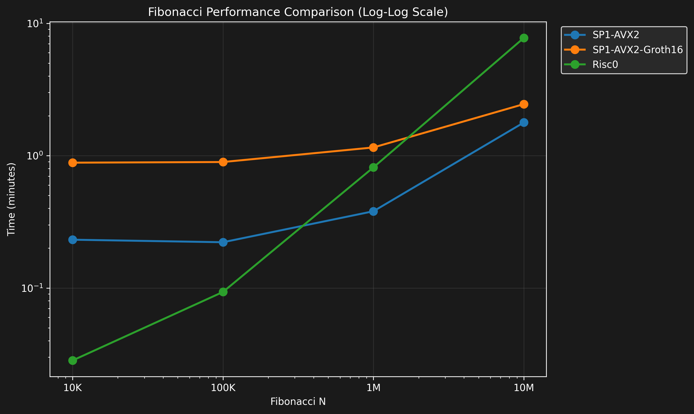
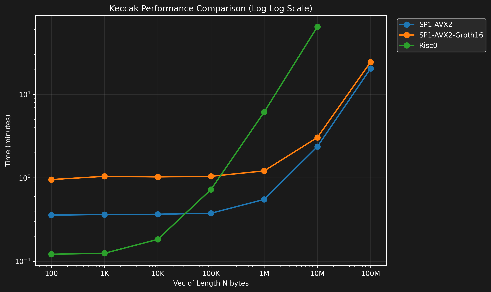
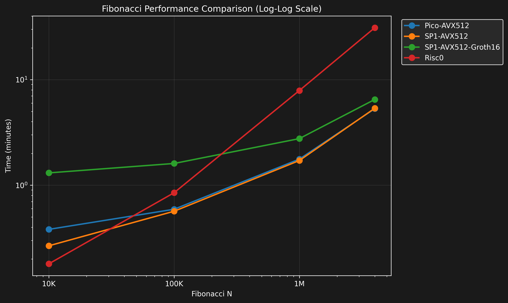
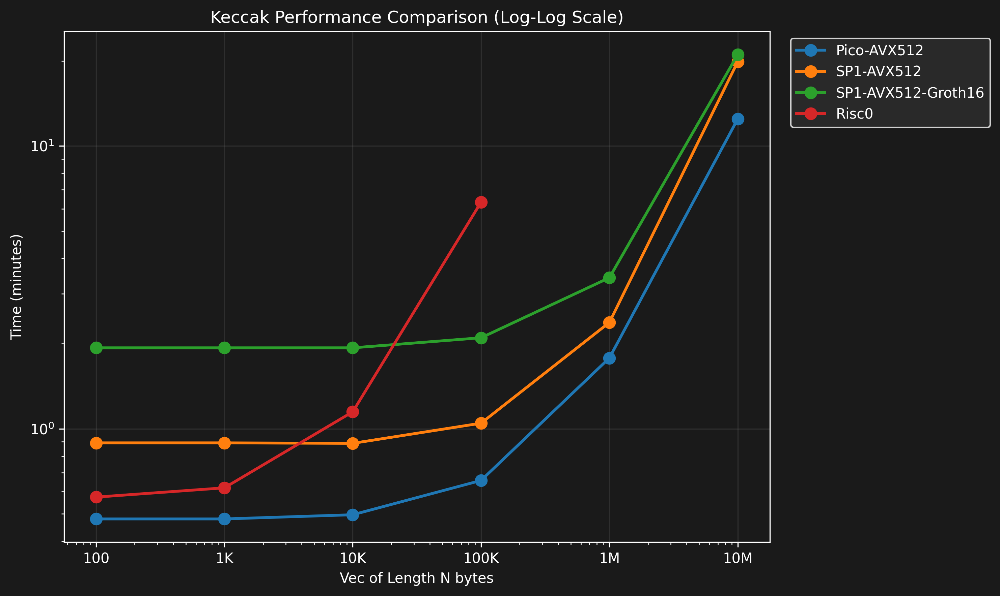

# zkVMs benchmarks

## About the project

Benchmarks of VM proving times made by Aligned.

The benchmarks test the following programs:

- ✅ Fibonacci
- ✅ Keccak
- 🏗️ [RSP (Reth Succinct Processor)](https://github.com/succinctlabs/rsp)

The benchmarks are run on the following provers:

- [SP1](https://docs.succinct.xyz/docs/sp1/introduction)
- [Risc0](https://risczero.com/)
- [Pico](https://docs.brevis.network/)

Raw results can be found [here](/bench_results)

## GPU Benchmarks on NVIDIA RTX A6000

The data was collected on a server with the following specs:

- GPU: NVIDIA RTX A6000 (48GB)
- RAM: 44GB
- OS: Ubuntu 22 LTS

### Fibonacci Benchmark



### Keccak Benchmark



## CPU Benchmarks on AMD EPYC 8534P (64 cores, 576 GiB ram)

The data was collected on a server with the following specs:
- CPU: AMD EPYC 8534P 64-Core Processor
- RAM: 576GB
- OS: Ubuntu 24 LTS

### Fibonacci Benchmark



### Keccak Benchmark



## [RSP](https://github.com/succinctlabs/rsp) Benchmarks

The blocks used for the benchmark are available in [block data](/block_data).

| block_number | block_time       | gas_used (MegaGas) | etherscan_link                                           |
|--------------|------------------|--------------------|----------------------------------------------------------|
| 21688509     | 2025-01-23 16:52 | 1.00               | [View on Etherscan](https://etherscan.io/block/21688509) |
| 20852412     | 2024-09-28 23:27 | 3.00               | [View on Etherscan](https://etherscan.io/block/20852412) |
| 19874787     | 2024-05-15 10:28 | 6.00               | [View on Etherscan](https://etherscan.io/block/19874787) |
| 21066632     | 2024-10-28 20:51 | 9.00               | [View on Etherscan](https://etherscan.io/block/21066632) |
| 21363516     | 2024-12-09 07:41 | 12.00              | [View on Etherscan](https://etherscan.io/block/21363516) |
| 21136535     | 2024-11-07 15:01 | 15.00              | [View on Etherscan](https://etherscan.io/block/21136535) |
| 20967372     | 2024-10-15 00:25 | 18.00              | [View on Etherscan](https://etherscan.io/block/20967372) |
| 20607931     | 2024-08-25 20:16 | 21.00              | [View on Etherscan](https://etherscan.io/block/20607931) |
| 21574864     | 2025-01-07 20:04 | 24.00              | [View on Etherscan](https://etherscan.io/block/21574864) |
| 21077746     | 2024-10-30 10:04 | 27.00              | [View on Etherscan](https://etherscan.io/block/21077746) |
| 21926929     | 2024-10-30 23:58 | 36.00              | [View on Etherscan](https://etherscan.io/block/21926929) |


## Notes

It's important to note most provers have a pipeline for proof generation that looks like this:

base_proofs -> recursive_stark_proof -> snark_proof

Each step of this pipeline adds more proving time and reduces proof size. The final step is only needed to verify directly in Ethereum.

SP1 is benched with recursive_stark and snark proof. Pico is always using the snark proof.

Aligned supports verification of proofs of any stage, so you can use the faster one you see

## How to run

### Requirements

- risc0
- sp1
- pico
- Docker (For SP1 groth16 compression)

### Running all benchmarks

To run all benchmarks, first do a run with small programs to see if everything is working:

```shell
TEST_MODE=1 bash benchmark.sh
```

If you are benching Groth16 in SP1, try proving a small program manually to double check it's fine. First run will also download SP1 docker image for groth16 compression, so the values for that bench may be off on this first run.

```shell
make build_fibo_sp1
PROOF_MODE=groth16 N=5 make fibo_sp1
make build_keccak_sp1
PROOF_MODE=groth16 N=5 make keccak_sp1
```

After making sure it works, you can run:

```shell
bash benchmark.sh
```

### Running the fibonacci benchmark

#### Using CPU

To run the benchmark, first do a run with small programs to see if everything is working:

```shell
TEST_MODE=1 bash benchmark_fibo.sh
```

If you are benching Groth16 in SP1, try proving a small program manually to double check it's fine. First run will also download SP1 docker image for groth16 compression, so the values for that bench may be off on this first run.

```shell
make build_fibo_sp1
PROOF_MODE=groth16 N=5 make fibo_sp1
```

After making sure it works, you can run:

```shell
bash benchmark_fibo.sh
```

#### Using GPU (CUDA)

To run the benchmark using CUDA, first do a run with small programs to see if everything is working:

```shell
TEST_MODE=1 bash benchmark_fibo_cuda.sh
```

If you are benching Groth16 in SP1, try proving a small program manually to double check it's fine. First run will also download SP1 docker image for groth16 compression, so the values for that bench may be off on this first run.

```shell
make build_fibo_sp1
SP1_PROVER="cuda" PROOF_MODE=groth16 N=5 make fibo_sp1
```

After making sure it works, you can run:

```shell
bash benchmark_fibo_cuda.sh
```

### Running the keccak benchmark

#### Using CPU

To run the benchmark, first do a run with small programs to see if everything is working:

```shell
TEST_MODE=1 bash benchmark_keccak.sh
```

If you are benching Groth16 in SP1, try proving a small program manually to double check it's fine. First run will also download SP1 docker image for groth16 compression, so the values for that bench may be off on this first run.

```shell
make build_keccak_sp1
PROOF_MODE=groth16 N=5 make keccak_sp1
```

After making sure it works, you can run:

```shell
bash benchmark_keccak.sh
```

#### Using GPU (CUDA)


To run the benchmark using CUDA, first do a run with small programs to see if everything is working:

```shell
TEST_MODE=1 bash benchmark_keccak_cuda.sh
```

If you are benching Groth16 in SP1, try proving a small program manually to double check it's fine. First run will also download SP1 docker image for groth16 compression, so the values for that bench may be off on this first run.

```shell
make build_keccak_sp1
SP1_PROVER="cuda" PROOF_MODE=groth16 N=5 make keccak_sp1
```

After making sure it works, you can run:

```shell
bash benchmark_keccak_cuda.sh
```

## Setting up the server

### Ubuntu CPU

```sh
# Install system dependencies and Docker
sudo apt-get update
sudo apt-get install -y gcc pkg-config libssl-dev build-essential apt-transport-https ca-certificates curl software-properties-common
sudo install -m 0755 -d /etc/apt/keyrings
sudo curl -fsSL https://download.docker.com/linux/ubuntu/gpg -o /etc/apt/keyrings/docker.asc
sudo chmod a+r /etc/apt/keyrings/docker.asc
echo \
  "deb [arch=$(dpkg --print-architecture) signed-by=/etc/apt/keyrings/docker.asc] https://download.docker.com/linux/ubuntu \
  $(. /etc/os-release && echo "${UBUNTU_CODENAME:-$VERSION_CODENAME}") stable" | \
  sudo tee /etc/apt/sources.list.d/docker.list > /dev/null
sudo apt-get update
sudo apt-get install -y docker-ce docker-ce-cli containerd.io docker-buildx-plugin docker-compose-plugin
sudo groupadd docker || true
sudo usermod -aG docker $USER
sudo systemctl restart docker

# Install and setup Rust
curl --proto '=https' --tlsv1.2 -sSf https://sh.rustup.rs | sh -s -- -y
export PATH="$HOME/.cargo/bin:$PATH"
. "$HOME/.cargo/env"
rustup toolchain install nightly
rustup component add rust-src --toolchain nightly-2024-11-27-x86_64-unknown-linux-gnu

# Install remaining tools
curl -L https://sp1.succinct.xyz | bash
source "$HOME/.bashrc"
sp1up
curl -L https://risczero.com/install | bash
. "$HOME/.bashrc"
rzup install
cargo +nightly install --git https://github.com/brevis-network/pico pico-cli

echo "Installation complete! Please run 'newgrp docker' or log out and back in to use Docker without sudo."
```

### Debian

Change the docker installation to the debian one, then use the same script as Ubuntu

### Ubuntu GPU

```sh
#!/bin/bash

## GCC needs to match coda version, 9.0 or 10.0 may be needed, 11 may not work

sudo apt-get update
sudo apt install gcc pkg-config libssl-dev build-essential apt-transport-https ca-certificates curl software-properties-common

# DOCKER

# Add Docker's official GPG key:

sudo apt-get update
sudo apt-get install ca-certificates curl
sudo install -m 0755 -d /etc/apt/keyrings
sudo curl -fsSL https://download.docker.com/linux/ubuntu/gpg -o /etc/apt/keyrings/docker.asc
sudo chmod a+r /etc/apt/keyrings/docker.asc

# Add the repository to Apt sources:

echo \
 "deb [arch=$(dpkg --print-architecture) signed-by=/etc/apt/keyrings/docker.asc] https://download.docker.com/linux/ubuntu \
 $(. /etc/os-release && echo "${UBUNTU_CODENAME:-$VERSION_CODENAME}") stable" | \
 sudo tee /etc/apt/sources.list.d/docker.list > /dev/null

sudo apt-get update
sudo apt-get install docker-ce docker-ce-cli containerd.io docker-buildx-plugin docker-compose-plugin

# USER DOCKER

sudo groupadd docker
sudo usermod -aG docker $USER
newgrp docker

#CUDA
# Install x

wget https://developer.download.nvidia.com/compute/cuda/repos/ubuntu2204/x86_64/cuda-keyring_1.0-1_all.deb
sudo dpkg -i cuda-keyring_1.0-1_all.deb
sudo apt-get update
sudo apt-get install cuda
export PATH=/usr/local/cuda/bin${PATH:+:${PATH}} export LD_LIBRARY_PATH=/usr/local/cuda/lib64${LD_LIBRARY_PATH:+:${LD_LIBRARY_PATH}}
source ~/.bashrc

sudo apt-get install nvidia-cuda-toolkit

# This may be needed for risc0:
export CUDA_HOME=/usr/local/cuda
export LD_LIBRARY_PATH=$CUDA_HOME/lib64:$LD_LIBRARY_PATH

sudo apt install gcc-9 g++-9

export CC=/usr/bin/gcc-9 
export CXX=/usr/bin/g++-9
export CPATH=/usr/local/cuda/include:$CPATH export LIBRARY_PATH=/usr/local/cuda/lib64:$LIBRARY_PATH

# Docker cuda

# #Add NVIDIA Container Toolkit repository
curl -fsSL https://nvidia.github.io/libnvidia-container/gpgkey | sudo gpg --dearmor -o /usr/share/keyrings/nvidia-container-toolkit-keyring.gpg

curl -s -L https://nvidia.github.io/libnvidia-container/stable/deb/nvidia-container-toolkit.list | \
  sed 's#deb https://#deb [signed-by=/usr/share/keyrings/nvidia-container-toolkit-keyring.gpg] https://#g' | \
  sudo tee /etc/apt/sources.list.d/nvidia-container-toolkit.list

sudo apt-get update

sudo apt-get install -y nvidia-container-toolkit

sudo nvidia-ctk runtime configure --runtime=docker
sudo systemctl restart docker

##Test
docker run --gpus all --rm debian:stretch nvidia-smi

#RUST

curl --proto '=https' --tlsv1.2 -sSf https://sh.rustup.rs | sh
. "$HOME/.cargo/env"

#PROVERS
curl -L https://sp1.succinct.xyz | bash
source /home/paperspace/.bashrc
sp1up

curl -L https://risczero.com/install | bash
. "/home/paperspace/.bashrc"
rzup install
rzup install r0vm 1.2.4
```

### Plotting results

To plot the results, you can use the `plotter.py` script. It will plot the results of the benchmarks and save the plot as a `.png` file.

#### Install dependencies

You can use your own python environment or create a virtual environment and then activate it:

```shell
make create_python_venv
. venv/bin/activate
```

#### Install dependencies

```shell
make install_requirements
```

#### Plotting results

```shell
make run_plotter INPUT_FILE=<path_to_file>.csv X_LABEL=<x_label> FUNCTION=<function>
```

#### Plotting Fibonacci results

```shell
make run_plotter_fibo INPUT_FILE=<path_to_file>.csv [LINEAR=1]
```

If no INPUT_FILE is provided, it will use the default file `benchmark_fibo_results.csv`.

Default plot is log log, ```USE_LINEAR=1``` will make it linear

#### Plotting Keccak results

```shell
make run_plotter_keccak INPUT_FILE=<path_to_file>.csv [LINEAR=1]
```

If no INPUT_FILE is provided, it will use the default file `benchmark_keccak_results.csv`.

The output will be `<path_to_file>.png`.

Default plot is log log, ```USE_LINEAR=1``` will make it linear

## Using the jupyter notebook

Install required python libraries on ```requirements.txt``` and run with ```jupyter lab benchmark.ipynb```or ```jupyter notebook benchmark.ipynb```

To export the notebook to html

```shell
make export_notebook
```

## Acknowledgments

To build this benches, we used provers made by Risc0, Succinct, and Pico. We also used examples of each as starting points for the programs
